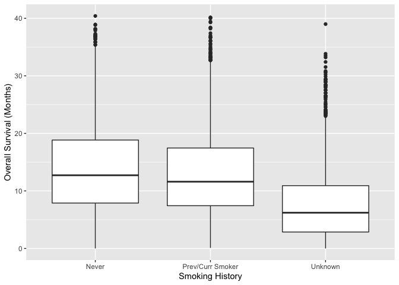

# 0.1 Introduction

This is a data exploration into the datasets from the
[datateachr](https://github.com/UBC-MDS/datateachr) package as well as
external datasets from [cBioPortal](https://www.cbioportal.org).
Initially, 4 datasets will be chosen to be further explored. We will
then choose a single dataset for which we will formulate research
questions to address with an in-depth analysis.

The primary tool for data cleaning and visualization will be *dplyr* and
*ggplot* respectively.

# 0.2 Load required libraries

    #packages must first be installed locally before they can be loaded
    library(datateachr)
    library(tidyverse)
    library(readr)

# 1.1 Choosing datasets

I have chosen two datasets from *datateachr* and two external datasets
that were of personal interest to me as the starting point for our
analysis.

1.  apt\_buildings
2.  cancer\_sample
3.  MSK-IMPACT Clinical Sequencing Cohort, available
    [here](https://www.cbioportal.org/study/clinicalData?id=msk_impact_2017).
    This contains clinical data on patients with various types of cancer
    who had their tumour sequenced.
4.  buparlisib and letrozole in ER+ metastatic breast cancer, available
    [here](https://www.cbioportal.org/study/clinicalData?id=brca_mskcc_2019).
    This contains clinical data on patients with cancer who were
    enrolled into a clinical trial for the two two drugs.

# 1.2 Data overview

We will now use base R and tidyverse tools to gain a better
understanding of the data contained within each dataset. The first two
datasets can simply be loaded natively in R using `apt_buildings` and
`cancer_sample` as we have already loaded the *datateachr* package. The
last two datasets must be first downloaded and then imported using the
*readr* package. Using the `quick_look` function, we will be able to
extract the dimensions, name of the variables, and class of the dataset,
as well as whether it contains any NA values.

    #function to quickly gain key insights into a dataset
    quick_look <- function(df) {
      glimpse(df)
      print(class(df))
      paste("Contains NA?", any(is.na(df)))
    }

    #first we will look at the apt_buildings dataset from datateachr
    apt_buildings <- apt_buildings
    quick_look(apt_buildings)

    ## Rows: 3,455
    ## Columns: 37
    ## $ id                               <dbl> 10359, 10360, 10361, 10362, 10363, 10…
    ## $ air_conditioning                 <chr> "NONE", "NONE", "NONE", "NONE", "NONE…
    ## $ amenities                        <chr> "Outdoor rec facilities", "Outdoor po…
    ## $ balconies                        <chr> "YES", "YES", "YES", "YES", "NO", "NO…
    ## $ barrier_free_accessibilty_entr   <chr> "YES", "NO", "NO", "YES", "NO", "NO",…
    ## $ bike_parking                     <chr> "0 indoor parking spots and 10 outdoo…
    ## $ exterior_fire_escape             <chr> "NO", "NO", "NO", "YES", "NO", NA, "N…
    ## $ fire_alarm                       <chr> "YES", "YES", "YES", "YES", "YES", "Y…
    ## $ garbage_chutes                   <chr> "YES", "YES", "NO", "NO", "NO", "NO",…
    ## $ heating_type                     <chr> "HOT WATER", "HOT WATER", "HOT WATER"…
    ## $ intercom                         <chr> "YES", "YES", "YES", "YES", "YES", "Y…
    ## $ laundry_room                     <chr> "YES", "YES", "YES", "YES", "YES", "Y…
    ## $ locker_or_storage_room           <chr> "NO", "YES", "YES", "YES", "NO", "YES…
    ## $ no_of_elevators                  <dbl> 3, 3, 0, 1, 0, 0, 0, 2, 4, 2, 0, 2, 2…
    ## $ parking_type                     <chr> "Underground Garage , Garage accessib…
    ## $ pets_allowed                     <chr> "YES", "YES", "YES", "YES", "YES", "Y…
    ## $ prop_management_company_name     <chr> NA, "SCHICKEDANZ BROS. PROPERTIES", N…
    ## $ property_type                    <chr> "PRIVATE", "PRIVATE", "PRIVATE", "PRI…
    ## $ rsn                              <dbl> 4154812, 4154815, 4155295, 4155309, 4…
    ## $ separate_gas_meters              <chr> "NO", "NO", "NO", "NO", "NO", "NO", "…
    ## $ separate_hydro_meters            <chr> "YES", "YES", "YES", "YES", "YES", "Y…
    ## $ separate_water_meters            <chr> "NO", "NO", "NO", "NO", "NO", "NO", "…
    ## $ site_address                     <chr> "65  FOREST MANOR RD", "70  CLIPPER R…
    ## $ sprinkler_system                 <chr> "YES", "YES", "NO", "YES", "NO", "NO"…
    ## $ visitor_parking                  <chr> "PAID", "FREE", "UNAVAILABLE", "UNAVA…
    ## $ ward                             <chr> "17", "17", "03", "03", "02", "02", "…
    ## $ window_type                      <chr> "DOUBLE PANE", "DOUBLE PANE", "DOUBLE…
    ## $ year_built                       <dbl> 1967, 1970, 1927, 1959, 1943, 1952, 1…
    ## $ year_registered                  <dbl> 2017, 2017, 2017, 2017, 2017, NA, 201…
    ## $ no_of_storeys                    <dbl> 17, 14, 4, 5, 4, 4, 4, 7, 32, 4, 4, 7…
    ## $ emergency_power                  <chr> "NO", "YES", "NO", "NO", "NO", "NO", …
    ## $ `non-smoking_building`           <chr> "YES", "NO", "YES", "YES", "YES", "NO…
    ## $ no_of_units                      <dbl> 218, 206, 34, 42, 25, 34, 14, 105, 57…
    ## $ no_of_accessible_parking_spaces  <dbl> 8, 10, 20, 42, 12, 0, 5, 1, 1, 6, 12,…
    ## $ facilities_available             <chr> "Recycling bins", "Green Bin / Organi…
    ## $ cooling_room                     <chr> "NO", "NO", "NO", "NO", "NO", "NO", "…
    ## $ no_barrier_free_accessible_units <dbl> 2, 0, 0, 42, 0, NA, 14, 0, 0, 1, 25, …
    ## [1] "tbl_df"     "tbl"        "data.frame"

    ## [1] "Contains NA? TRUE"

    #repeat for cancer_sample 
    cancer_sample <- cancer_sample
    quick_look(cancer_sample)

    ## Rows: 569
    ## Columns: 32
    ## $ ID                      <dbl> 842302, 842517, 84300903, 84348301, 84358402, …
    ## $ diagnosis               <chr> "M", "M", "M", "M", "M", "M", "M", "M", "M", "…
    ## $ radius_mean             <dbl> 17.990, 20.570, 19.690, 11.420, 20.290, 12.450…
    ## $ texture_mean            <dbl> 10.38, 17.77, 21.25, 20.38, 14.34, 15.70, 19.9…
    ## $ perimeter_mean          <dbl> 122.80, 132.90, 130.00, 77.58, 135.10, 82.57, …
    ## $ area_mean               <dbl> 1001.0, 1326.0, 1203.0, 386.1, 1297.0, 477.1, …
    ## $ smoothness_mean         <dbl> 0.11840, 0.08474, 0.10960, 0.14250, 0.10030, 0…
    ## $ compactness_mean        <dbl> 0.27760, 0.07864, 0.15990, 0.28390, 0.13280, 0…
    ## $ concavity_mean          <dbl> 0.30010, 0.08690, 0.19740, 0.24140, 0.19800, 0…
    ## $ concave_points_mean     <dbl> 0.14710, 0.07017, 0.12790, 0.10520, 0.10430, 0…
    ## $ symmetry_mean           <dbl> 0.2419, 0.1812, 0.2069, 0.2597, 0.1809, 0.2087…
    ## $ fractal_dimension_mean  <dbl> 0.07871, 0.05667, 0.05999, 0.09744, 0.05883, 0…
    ## $ radius_se               <dbl> 1.0950, 0.5435, 0.7456, 0.4956, 0.7572, 0.3345…
    ## $ texture_se              <dbl> 0.9053, 0.7339, 0.7869, 1.1560, 0.7813, 0.8902…
    ## $ perimeter_se            <dbl> 8.589, 3.398, 4.585, 3.445, 5.438, 2.217, 3.18…
    ## $ area_se                 <dbl> 153.40, 74.08, 94.03, 27.23, 94.44, 27.19, 53.…
    ## $ smoothness_se           <dbl> 0.006399, 0.005225, 0.006150, 0.009110, 0.0114…
    ## $ compactness_se          <dbl> 0.049040, 0.013080, 0.040060, 0.074580, 0.0246…
    ## $ concavity_se            <dbl> 0.05373, 0.01860, 0.03832, 0.05661, 0.05688, 0…
    ## $ concave_points_se       <dbl> 0.015870, 0.013400, 0.020580, 0.018670, 0.0188…
    ## $ symmetry_se             <dbl> 0.03003, 0.01389, 0.02250, 0.05963, 0.01756, 0…
    ## $ fractal_dimension_se    <dbl> 0.006193, 0.003532, 0.004571, 0.009208, 0.0051…
    ## $ radius_worst            <dbl> 25.38, 24.99, 23.57, 14.91, 22.54, 15.47, 22.8…
    ## $ texture_worst           <dbl> 17.33, 23.41, 25.53, 26.50, 16.67, 23.75, 27.6…
    ## $ perimeter_worst         <dbl> 184.60, 158.80, 152.50, 98.87, 152.20, 103.40,…
    ## $ area_worst              <dbl> 2019.0, 1956.0, 1709.0, 567.7, 1575.0, 741.6, …
    ## $ smoothness_worst        <dbl> 0.1622, 0.1238, 0.1444, 0.2098, 0.1374, 0.1791…
    ## $ compactness_worst       <dbl> 0.6656, 0.1866, 0.4245, 0.8663, 0.2050, 0.5249…
    ## $ concavity_worst         <dbl> 0.71190, 0.24160, 0.45040, 0.68690, 0.40000, 0…
    ## $ concave_points_worst    <dbl> 0.26540, 0.18600, 0.24300, 0.25750, 0.16250, 0…
    ## $ symmetry_worst          <dbl> 0.4601, 0.2750, 0.3613, 0.6638, 0.2364, 0.3985…
    ## $ fractal_dimension_worst <dbl> 0.11890, 0.08902, 0.08758, 0.17300, 0.07678, 0…
    ## [1] "spec_tbl_df" "tbl_df"      "tbl"         "data.frame"

    ## [1] "Contains NA? FALSE"

    #we must first import the last 2 data sets, and again look at their features
    msk <- read_tsv("msk_impact_2017_clinical_data.tsv")
    quick_look(msk)

    ## Rows: 10,945
    ## Columns: 26
    ## $ `Study ID`                      <chr> "msk_impact_2017", "msk_impact_2017", …
    ## $ `Patient ID`                    <chr> "P-0000004", "P-0000015", "P-0000023",…
    ## $ `Sample ID`                     <chr> "P-0000004-T01-IM3", "P-0000015-T01-IM…
    ## $ `Cancer Type`                   <chr> "Breast Cancer", "Breast Cancer", "Mes…
    ## $ `Cancer Type Detailed`          <chr> "Breast Invasive Ductal Carcinoma", "B…
    ## $ `DNA Input`                     <dbl> 250, 198, 250, 250, 250, 250, 250, 250…
    ## $ `Fraction Genome Altered`       <dbl> 0.2782, 0.3503, 0.1596, 0.3878, 0.0000…
    ## $ `Matched Status`                <chr> "Matched", "Matched", "Matched", "Matc…
    ## $ `Metastatic Site`               <chr> NA, "Liver", NA, "Lung", NA, "Peritone…
    ## $ `Mutation Count`                <dbl> 16, 7, 5, 6, 1, 2, 4, 1, 10, 12, 3, 4,…
    ## $ `Oncotree Code`                 <chr> "IDC", "IDC", "PEMESO", "UEC", "USC", …
    ## $ `Overall Survival (Months)`     <dbl> NA, NA, 8.71, 36.75, 8.81, 8.81, NA, N…
    ## $ `Overall Survival Status`       <chr> "0:LIVING", "1:DECEASED", "1:DECEASED"…
    ## $ `Primary Tumor Site`            <chr> "Breast", "Breast", "Peritoneum", "Ute…
    ## $ `Sample Class`                  <chr> "Tumor", "Tumor", "Tumor", "Tumor", "T…
    ## $ `Sample Collection Source`      <chr> "Outside", "In-House", "In-House", "In…
    ## $ `Number of Samples Per Patient` <dbl> 1, 1, 1, 1, 2, 2, 1, 1, 1, 1, 1, 2, 2,…
    ## $ `Sample coverage`               <dbl> 428, 281, 454, 1016, 1161, 1147, 1222,…
    ## $ `Sample Type`                   <chr> "Primary", "Metastasis", "Primary", "M…
    ## $ Sex                             <chr> "Female", "Female", "Male", "Female", …
    ## $ `Smoking History`               <chr> "Unknown", "Never", "Never", "Prev/Cur…
    ## $ `Somatic Status`                <chr> "Matched", "Matched", "Matched", "Matc…
    ## $ `Specimen Preservation Type`    <chr> "FFPE", "FFPE", "FFPE", "FFPE", "FFPE"…
    ## $ `Specimen Type`                 <chr> "Biopsy", "Biopsy", "Biopsy", "Resecti…
    ## $ `Tumor Purity`                  <dbl> 50, 40, 30, 40, NA, 30, 10, NA, 40, 40…
    ## $ `Patient's Vital Status`        <chr> "ALIVE", "DECEASED", "DECEASED", "ALIV…
    ## [1] "spec_tbl_df" "tbl_df"      "tbl"         "data.frame"

    ## [1] "Contains NA? TRUE"

    metastatic_BC <- read_tsv("brca_mskcc_2019_clinical_data.tsv")
    quick_look(metastatic_BC)

    ## Rows: 70
    ## Columns: 29
    ## $ `Study ID`                      <chr> "brca_mskcc_2019", "brca_mskcc_2019", …
    ## $ `Patient ID`                    <chr> "p_DS_bkm_001", "p_DS_bkm_002", "p_DS_…
    ## $ `Sample ID`                     <chr> "s_DS_bkm_001_T", "s_DS_bkm_002_T", "s…
    ## $ `Best Response to Therapy`      <chr> "Stable Disease", "Stable Disease", "P…
    ## $ `block accession`               <chr> "S09-21571-3D", "07-TJ-947-D", "S10-88…
    ## $ `Cancer Type`                   <chr> "Breast Cancer", "Breast Cancer", "Bre…
    ## $ `Cancer Type Detailed`          <chr> "Invasive Breast Carcinoma", "Invasive…
    ## $ Comments                        <chr> NA, NA, NA, NA, NA, NA, NA, NA, NA, NA…
    ## $ `Fraction Genome Altered`       <dbl> 0.1565, 0.2533, 0.6218, 0.1038, 0.3070…
    ## $ `Gene Panel`                    <chr> "IMPACT341", "IMPACT341", "IMPACT341",…
    ## $ `months on study`               <dbl> 11, 4, 3, 1, 2, 10, 11, 6, 2, 1, 7, 2,…
    ## $ `Months on Treatment`           <dbl> NA, NA, NA, NA, NA, NA, NA, NA, NA, NA…
    ## $ `Mutation Count`                <dbl> 7, 8, 7, 10, 5, 8, 5, 5, 6, 7, 7, 10, …
    ## $ `Oncotree Code`                 <chr> "BRCA", "BRCA", "BRCA", "BRCA", "BRCA"…
    ## $ `Other Patient ID`              <chr> NA, NA, NA, NA, NA, NA, NA, NA, NA, NA…
    ## $ `patient study id`              <dbl> 5501, 5503, 5504, 5505, 5507, 5508, 55…
    ## $ `PIK3CA Mutation`               <chr> NA, NA, NA, NA, NA, NA, NA, NA, NA, NA…
    ## $ `reason for tx discontinuation` <chr> "PD", "PD", "TOX", "TOX", "TOX", "TOX"…
    ## $ `Sample Class`                  <chr> "Tumor", "Tumor", "Tumor", "Tumor", "T…
    ## $ `Number of Samples Per Patient` <dbl> 1, 1, 1, 1, 1, 1, 1, 1, 1, 1, 1, 1, 1,…
    ## $ `Sample origin`                 <chr> "FFPE", "FFPE", "FFPE", "FFPE", "FFPE"…
    ## $ `Sample Type`                   <chr> "Primary", "Primary", "Metastasis", "M…
    ## $ Sex                             <chr> NA, NA, NA, NA, NA, NA, NA, NA, NA, NA…
    ## $ `snapshot mutations`            <chr> "Not detected", "NE", "PTEN loss/p110a…
    ## $ `Somatic Status`                <chr> "Unmatched", "Unmatched", "Unmatched",…
    ## $ Status                          <chr> NA, NA, NA, NA, NA, NA, NA, NA, NA, NA…
    ## $ `study arm`                     <chr> "A - Continuous", "A - Continuous", "A…
    ## $ therapy                         <chr> "BKM120", "BKM120", "BKM120", "BKM120"…
    ## $ `Treatment best response`       <chr> NA, NA, NA, NA, NA, NA, NA, NA, NA, NA…
    ## [1] "spec_tbl_df" "tbl_df"      "tbl"         "data.frame"

    ## [1] "Contains NA? TRUE"

    #keept the msk variable names as strings as they could be easily incorporated into markdown text.  

# 1.3 Choosing 2 of the 4 datasets

The above data exploration has provided us with basic but valuable
insights into the data contained within each dataset. All datasets
followed the “tibble” convention of having columns as variables and rows
as individual observation. Data in this form is clean when it does not
contain any missing values.

1.  The `apt_buildings` dataset is composed of up to 37 aspects of 3,455
    buildings in Toronto. As the data contains NA values, it is not
    clean and hence why not all 37 aspects will be described for each
    building. It appears to be primarily categorical data, as many of
    the numeric variables are not continuous, but rather only take on a
    subset of discrete values (ie. `no_of_elevators` only contains 11
    distinct values).

2.  The `cancer_sample` dataset is composed of 32 features of 569 images
    of cancer samples. As the data does not contain NA values, it is
    clean. it is composed of only continuous data, other than
    `diagnosis` which is categorical and `ID` which uniquely identifies
    each row.

3.  The `msk` dataset is composed of 26 aspects of 10,945 patient
    enrollments into the MSK-IMPACT tumour sequencing study. As the data
    contains NA values, it is not clean. It contains variables
    describing characteristics of both the patient and the tumour.

4.  The `metastatic_BC` dataset is composed of 29 aspects of 70 patient
    enrollments into a clincial trial for the drugs buparlisib and
    letrozole in estrogen receptor-positive, metastatic breast cancer.
    As the data contains NA values, it is not clean.Variables describe
    both patient and tumour characteristics, with several variables
    related to relevant aspects and outcomes of the clinical trial.

From the insights into the dataset that we extracted, I have chosen the
`msk` and `metastatic_BC` datasets as they are the only two containing
clinical data of cancer patients. This is an area I am passionate about
and I hope to pursue a career as an oncologist or translational
scientist in the future. As well, while the `cancer_sample` dataset is
also related to the field, it contains data derived from machine
learning deconvolution of cancer sample images rather than clinical data
of the patients themselves. Hence, the 2 external datasets better
reflect my personal interests and were chosen.

# 1.4 Choosing a single dataset

Looking at the `msk` dataset, there are several variables that describe
a potential outcome of interest, such as `Overall Survival (Months)` or
`Metastatic Site`. A potential research question could be “How is
`Smoking History` related to the patient’s disease course?”

Looking at the `metastatic_BC` dataset, it appears a variable describing
an outcome of interest could be `Best Response to Therapy`.
Particularly, a potential research question could be “Is the mutational
and genomic characteristics of a patient’s tumor predictive of their
`Best Response to Therapy`?”.

After having formulated research questions for both the datasets, I have
chosen the `msk` dataset as it is a larger cohort of patients and
includes various types of cancer. On the other hand, the `metastatic_BC`
dataset was gather from a clinical study and thus represents a more
homogeneous group of patients. The data was also gathered with the
hypothesis of testing the effectiveness of the experimental intervention
in mind. Thus, I believe the diversity of the `msk` dataset might lend
to a more interesting and open-ended exploration, hence why I chose it
for the next section of the project.

# 2.1 Data exploration

I will perform 4 data analysis exercises to gain a deeper understanding
of the data contained in `msk`.

**Exercise 1 :** Filtering of dataset to include only the 4 most common
types of cancer. This was done to make the dataset more manageable to
work with, as well as to stratify by cancer type in our analysis while
maintaining readability.

     #we first summarize the dataset to reflect how many patients there are for each cancer type, before selecting the top 4 and storing them in a vector
     most_common_cancer_types <- msk %>%
      group_by(`Cancer Type`) %>%
      summarize(n()) %>%
      arrange(desc(`n()`)) %>%
      head(4) %>%
      select(`Cancer Type`) %>%
      as_vector()

    #we then use the vector of the top 4 most common cancer types to filter the entire dataset 
    msk_most_common <- msk %>% filter(`Cancer Type` %in% most_common_cancer_types)

**Exercise 2 :** Plot of the density of `Mutation Count`. Since we took
a subset from the initial dataset that only contains the 4 most common
cancer types, we can observe the distribution for each type (whereas
including all cancer types from the orignal dataset would overwhelm the
plot).

    #To plot a single continuous variable, only the x aesthetic needs to be specified. It is plotted on a log scale to get a better sense of the distribution of the variable. 
    msk_most_common %>% ggplot(aes(x = `Mutation Count`)) +
      geom_density(aes(fill = `Cancer Type`), alpha = 0.3) +
      scale_x_log10() +
      scale_color_discrete()

    ## Warning: Transformation introduced infinite values in continuous x-axis

    ## Warning: Removed 198 rows containing non-finite values (stat_density).

    #The mutation count distribution is plotted for each cancer type so alpha is adjusted to increase the readability of the plot

**Exercise 3 :** Plot of the distribution of `Fraction Genome Altered`.
Histograms for each of the 4 most common cancer types can easily be
compared.

    #The fraction of the genome altered for different cancer types is plotted and faceted by rows for each type.
    msk_most_common %>% ggplot(aes(x = `Fraction Genome Altered`)) +
      geom_histogram() +
      facet_grid(rows = vars(`Cancer Type`), scales = "free_y")

    ## `stat_bin()` using `bins = 30`. Pick better value with `binwidth`.

    ## Warning: Removed 2 rows containing non-finite values (stat_bin).

    #The x axis is kept fixed to allow for objective comparison of the mutation counts between cancer types, while the y-axis is freed as we are more interested in the proportion rather than the absolute counts within each type since we the number of cases is not equal. 

**Exercise 4 :** Boxplot of `Overall Survival (Months)` across various
`Smoking History`. It is well established that smoking is a risk factor
for various types of cancer, and thus this should also be reflected in
our dataset.

    #Rows with NA for the smoking history variable is excluded as we do not want to included NA as a factor for our boxplots. 
    msk %>% filter(!is.na(`Smoking History`)) %>% ggplot(aes(x = `Smoking History`, y = `Overall Survival (Months)`)) +
      geom_boxplot()

    ## Warning: Removed 2801 rows containing non-finite values (stat_boxplot).

    #Since we do not stratify analysis by cancer type, we can use the initial dataset.

# 2.2 Exploration explained

The data exploration exercises performed both made the dataset more
manageable to work with as well as offered us a basic understanding of
our dataset to formulate research questions.

1.  Initially, the `msk` dataset contained 10945 cases of 59 different
    types of cancers. This woukd make it difficult to stratify for
    `Cancer Type` in our analysis, so the dataset was filtered to only
    contain the 4 most common types of cancer, which were: Non-Small
    Cell Lung Cancer, Breast Cancer, Colorectal Cancer, Prostate Cancer.
    This reduced the dataset to 4,716 cases, or 43% of the initial
    dataset.

2.  Next, I wanted to see the density distribution of `Mutation Count`
    for different types of cancer. It is well established that different
    cancer types have their unique mutational characteristics, so it was
    reassuring to see this reflected in our data.

3.  Similarly, I wanted to see the fraction of the genome altered
    differed for different types of cancer. Genomic instability is a
    hallmark of cancer, and also varies across different types.

4.  Finally, I looked at the overall survival for patients according to
    their `Smoking History`. Although it is known smoking is a risk
    factor for cancer, I wanted to see the effect on overall survival in
    our dataset.

# 3.1 Research questions

Following our exploratory data analysis, I formulated the following 4
research questions:

1.  Which `Cancer Type` is the most deadly?

2.  What variables are predictive of a patient’s overall survival?

3.  What are the genomic and mutational differences between primary and
    Metastasis samples?

4.  What are the genomic and mutational consequences of a patient’s
    smoking history?
