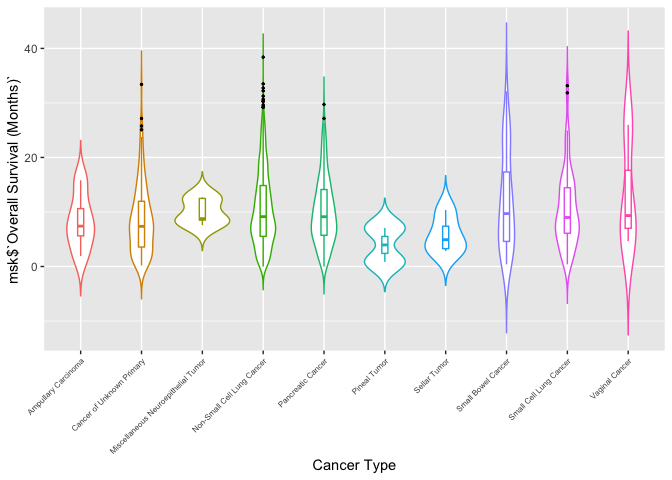
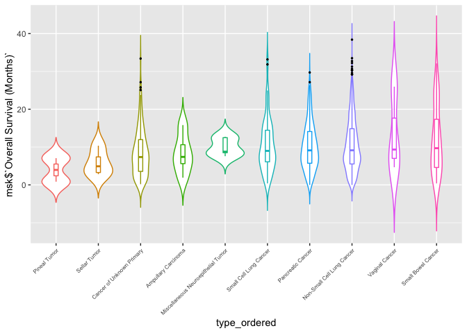
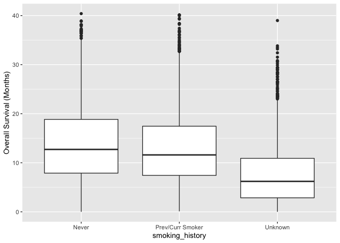
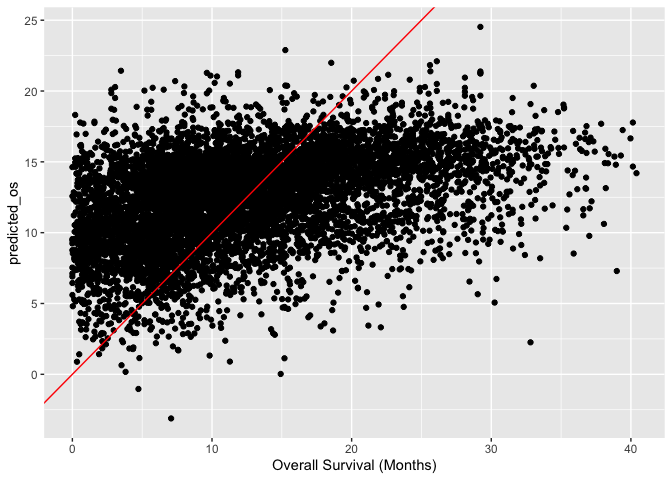

# Welcome to your last milestone in your mini data analysis project!

In Milestone 1, you explored your data and came up with research
questions. In Milestone 2, you obtained some results by making summary
tables and graphs.

In this (3rd) milestone, you’ll be sharpening some of the results you
obtained from your previous milestone by:

-   Manipulating special data types in R: factors and/or dates and
    times.
-   Fitting a model object to your data, and extract a result.
-   Reading and writing data as separate files.

**NOTE**: The main purpose of the mini data analysis is to integrate
what you learn in class in an analysis. Although each milestone provides
a framework for you to conduct your analysis, it’s possible that you
might find the instructions too rigid for your data set. If this is the
case, you may deviate from the instructions – just make sure you’re
demonstrating a wide range of tools and techniques taught in this class.

## Instructions

**To complete this milestone**, edit [this very `.Rmd`
file](https://raw.githubusercontent.com/UBC-STAT/stat545.stat.ubc.ca/master/content/mini-project/mini-project-3.Rmd)
directly. Fill in the sections that are tagged with
`<!--- start your work here--->`. =\]

**To submit this milestone**, make sure to knit this `.Rmd` file to an
`.md` file by changing the YAML output settings from
`output: html_document` to `output: github_document`. Commit and push
all of your work to your mini-analysis GitHub repository, and tag a
release on GitHub. Then, submit a link to your tagged release on canvas.

**Points**: This milestone is worth 40 points (compared to the usual 30
points): 30 for your analysis, and 10 for your entire mini-analysis
GitHub repository. Details follow.

**Research Questions**: In Milestone 2, you chose two research questions
to focus on. Wherever realistic, your work in this milestone should
relate to these research questions whenever we ask for justification
behind your work. In the case that some tasks in this milestone don’t
align well with one of your research questions, feel free to discuss
your results in the context of a different research question.

# Setup

Begin by loading your data and the tidyverse package below:

    # set wd to the parent folder as knitr automatically sets the working directory to the location of the Rmd file
    knitr::opts_knit$set(root.dir = dirname(getwd()))

    library(datateachr) # <- might contain the data you picked!
    library(tidyverse)
    library(broom)
    library(here)

    msk <- read_tsv("https://raw.githubusercontent.com/stat545ubc-2021/mini-data-analysis-EL/main/data/msk_impact_2017_clinical_data.tsv")
    #external datasets are first downloaded and loaded using readr

From Milestone 2, you chose two research questions. What were they? Put
them here.

<!-------------------------- Start your work below ---------------------------->

1.  Are patient variables or sample variables more predictive of overall
    survival?
2.  What are the differences in the genomic and mutational variables
    between primary and Metastasis samples?
    <!----------------------------------------------------------------------------->

# Exercise 1: Special Data Types (10)

For this exercise, you’ll be choosing two of the three tasks below –
both tasks that you choose are worth 5 points each.

But first, tasks 1 and 2 below ask you to modify a plot you made in a
previous milestone. The plot you choose should involve plotting across
at least three groups (whether by facetting, or using an aesthetic like
colour). Place this plot below (you’re allowed to modify the plot if
you’d like). If you don’t have such a plot, you’ll need to make one.
Place the code for your plot below.

<!-------------------------- Start your work below ---------------------------->

    # We filter the msk dataset to include only the 10 most deadly cancer types
    # Remove rows without a value for overall survival
    most_deadly_types <- msk %>%
      filter(!is.na(`Overall Survival (Months)`)) %>%
      group_by(`Cancer Type`) %>%
      summarize(median_os = median(`Overall Survival (Months)`)) %>%
      arrange(median_os) %>%
      head(10) %>%
      pull(`Cancer Type`)
    # store the names of the 10 cancer types as a vector and used it to filter the dataset

    msk_top10 <- msk %>%
      filter(`Cancer Type` %in% most_deadly_types & !is.na(`Overall Survival (Months)`))

    # write a function to re-create the plot later on in the project
    msk_osplot <- function(msk, type) {
      ggplot(msk, aes(x = {{type}}, y = msk$`Overall Survival (Months)`, color = {{type}})) +
        geom_violin(trim=FALSE) +
        geom_boxplot(width = 0.1, outlier.color = "black", outlier.size = 0.5) +
        theme(axis.text.x = element_text(size = 6, angle = 45, vjust = 1, hjust = 1), legend.position = "none")
      }

    # changes to the theme makes the geoms more visually appealing
    # the axis labels more readable, and the outliers more obvious

    msk_osplot(msk_top10, `Cancer Type`)

<!----------------------------------------------------------------------------->

Now, choose two of the following tasks.

1.  Produce a new plot that reorders a factor in your original plot,
    using the `forcats` package (3 points). Then, in a sentence or two,
    briefly explain why you chose this ordering (1 point here for
    demonstrating understanding of the reordering, and 1 point for
    demonstrating some justification for the reordering, which could be
    subtle or speculative.)

2.  Produce a new plot that groups some factor levels together into an
    “other” category (or something similar), using the `forcats` package
    (3 points). Then, in a sentence or two, briefly explain why you
    chose this grouping (1 point here for demonstrating understanding of
    the grouping, and 1 point for demonstrating some justification for
    the grouping, which could be subtle or speculative.)

3.  If your data has some sort of time-based column like a date (but
    something more granular than just a year):

    1.  Make a new column that uses a function from the `lubridate` or
        `tsibble` package to modify your original time-based column. (3
        points)
        -   Note that you might first have to *make* a time-based column
            using a function like `ymd()`, but this doesn’t count.
        -   Examples of something you might do here: extract the day of
            the year from a date, or extract the weekday, or let 24
            hours elapse on your dates.
    2.  Then, in a sentence or two, explain how your new column might be
        useful in exploring a research question. (1 point for
        demonstrating understanding of the function you used, and 1
        point for your justification, which could be subtle or
        speculative).
        -   For example, you could say something like “Investigating the
            day of the week might be insightful because penguins don’t
            work on weekends, and so may respond differently”.

<!-------------------------- Start your work below ---------------------------->

**Task Number**: 1

In the `msk` dataframe, the variable `Cancer Type` is of the character
class. Hence, the categories are by default ordered alphabetically when
plotted. By reordering this variable as a factor, the levels can be
instead sorted in ascending order of the median overall survival for
each cancer type. This helps readers rapidly determine the most deadly
type in the context being described by the plot.

    # We created a new factor variable for cancer type that is reordered from lowest to highest median overall survival

    msk_top10 <- msk_top10 %>%
      mutate(type_ordered = fct_reorder(`Cancer Type`, `Overall Survival (Months)`))

    # We then generate boxplots and violin plots of the overall survival for the 10 cancer types

    msk_osplot(msk_top10, type_ordered)

Compared to our previous plot, it is now clear that pineal tumour in our
dataset is the cancer type with the shortest median overall survival and
we can also clearly determine the order of the remaning types in our
plot.

<!----------------------------------------------------------------------------->
<!-------------------------- Start your work below ---------------------------->

**Task Number**: 2 For the `Smoking History` variable, several rows have
a missing value. As there is also a “Unknown” category for this
category, NA’s in this context would essentially contain the same
information, or the lack thereof, on the patient’s smoking history. Thus
these levels can be combined when setting this variable as a factor,
stored in smoking\_history.

    # define factor where NA's are assigned to "Unknown" in smoking history
    # remove NA's in overall survival
    msk_smoking <- msk %>%
      mutate(smoking_history = fct_explicit_na(`Smoking History`, na_level = "Unknown")) %>%
      filter(!is.na(`Overall Survival (Months)`))

    head(msk_smoking, 10)

    ## # A tibble: 10 × 27
    ##    `Study ID`      `Patient ID` `Sample ID`       `Cancer Type` `Cancer Type De…
    ##    <chr>           <chr>        <chr>             <chr>         <chr>           
    ##  1 msk_impact_2017 P-0000023    P-0000023-T01-IM3 Mesothelioma  Peritoneal Meso…
    ##  2 msk_impact_2017 P-0000024    P-0000024-T01-IM3 Endometrial … Uterine Endomet…
    ##  3 msk_impact_2017 P-0000025    P-0000025-T01-IM3 Endometrial … Uterine Serous …
    ##  4 msk_impact_2017 P-0000025    P-0000025-T02-IM5 Endometrial … Uterine Serous …
    ##  5 msk_impact_2017 P-0000037    P-0000037-T01-IM3 Hepatobiliar… Hepatocellular …
    ##  6 msk_impact_2017 P-0000037    P-0000037-T02-IM3 Hepatobiliar… Hepatocellular …
    ##  7 msk_impact_2017 P-0000041    P-0000041-T01-IM3 Breast Cancer Breast Invasive…
    ##  8 msk_impact_2017 P-0000042    P-0000042-T01-IM3 Mesothelioma  Pleural Mesothe…
    ##  9 msk_impact_2017 P-0000043    P-0000043-T02-IM3 Bladder Canc… Bladder Urothel…
    ## 10 msk_impact_2017 P-0000056    P-0000056-T01-IM3 Bladder Canc… Bladder Urothel…
    ## # … with 22 more variables: DNA Input <dbl>, Fraction Genome Altered <dbl>,
    ## #   Matched Status <chr>, Metastatic Site <chr>, Mutation Count <dbl>,
    ## #   Oncotree Code <chr>, Overall Survival (Months) <dbl>,
    ## #   Overall Survival Status <chr>, Primary Tumor Site <chr>,
    ## #   Sample Class <chr>, Sample Collection Source <chr>,
    ## #   Number of Samples Per Patient <dbl>, Sample coverage <dbl>,
    ## #   Sample Type <chr>, Sex <chr>, Smoking History <chr>, …

    msk_smoking %>%
      ggplot(aes(x = smoking_history, y = `Overall Survival (Months)`)) +
      geom_boxplot()

<!----------------------------------------------------------------------------->

# Exercise 2: Modelling

## 2.0 (no points)

Pick a research question, and pick a variable of interest (we’ll call it
“Y”) that’s relevant to the research question. Indicate these.

<!-------------------------- Start your work below ---------------------------->

**Research Question**: Are patient variables or sample variables more
predictive of overall survival?

**Variable of interest**: `Overall Survival (Months)`

<!----------------------------------------------------------------------------->

## 2.1 (5 points)

Fit a model or run a hypothesis test that provides insight on this
variable with respect to the research question. Store the model object
as a variable, and print its output to screen. We’ll omit having to
justify your choice, because we don’t expect you to know about model
specifics in STAT 545.

-   **Note**: It’s OK if you don’t know how these models/tests work.
    Here are some examples of things you can do here, but the sky’s the
    limit.
    -   You could fit a model that makes predictions on Y using another
        variable, by using the `lm()` function.
    -   You could test whether the mean of Y equals 0 using `t.test()`,
        or maybe the mean across two groups are different using
        `t.test()`, or maybe the mean across multiple groups are
        different using `anova()` (you may have to pivot your data for
        the latter two).
    -   You could use `lm()` to test for significance of regression.

<!-------------------------- Start your work below ---------------------------->

First, we can assign each variable as related to either the patient or
the sample, and store it in a new dataframe. Then, we clean the data in
preparation for modelling. Categorical variables with too many levels
such as `Metastatic Site` and `Primary Tumor Site` must be excluded.
There are also variables in our dataset that are perfectly correlated,
and hence for modelling purposes only one should be kept.

    # manually filter each variable and store in a new tibble
    msk_variables <- tibble(variable_msk = colnames(msk), variable_source = "Patient") %>%
      mutate(variable_source = case_when(
        variable_msk %in% c("DNA Input", "Fraction Genome Altered", "Mutation Count", "Sample Collection Source", "Number of Samples Per Patient", "Sample coverage", "Sample Type", "Somatic Status", "Specimen Preservation Type", "Specimen Type", "Tumor Purity") ~ "Sample",
        variable_msk %in% c("Overall Survival (Months)", "Sex", "Smoking History", "Patient's Vital Status") ~ "Patient",
        variable_msk %in% c("Study ID", "Patient ID", "Sample ID", "Cancer Type", "Cancer Type Detailed", "Matched Status", "Metastatic Site", "Overall Survival Status", "Primary Tumor Site", "Oncotree Code", "Sample Class") ~ "Neither"))

    # we only want to consider variables that are patient or sample attributes, the rest are set as "neither"
    # categorical variables with too many levels must also be excluded prior to modelling
    # perfectly colinear variables are also excluded

    print(msk_variables)

    ## # A tibble: 26 × 2
    ##    variable_msk            variable_source
    ##    <chr>                   <chr>          
    ##  1 Study ID                Neither        
    ##  2 Patient ID              Neither        
    ##  3 Sample ID               Neither        
    ##  4 Cancer Type             Neither        
    ##  5 Cancer Type Detailed    Neither        
    ##  6 DNA Input               Sample         
    ##  7 Fraction Genome Altered Sample         
    ##  8 Matched Status          Neither        
    ##  9 Metastatic Site         Neither        
    ## 10 Mutation Count          Sample         
    ## # … with 16 more rows

    # store variables that are relevant to our model so they can be selected

    msk_model_variables <- msk_variables %>%
      filter(variable_source != "Neither") %>%
      pull(variable_msk)

    # remove multiple variables that are not relevant for our model

    msk_clean <- msk %>%
      select(msk_model_variables) %>%
      na.omit() %>%
      mutate(`Smoking History` = ifelse(is.na(`Smoking History`), Unknown, `Smoking History`))

    ## Note: Using an external vector in selections is ambiguous.
    ## ℹ Use `all_of(msk_model_variables)` instead of `msk_model_variables` to silence this message.
    ## ℹ See <https://tidyselect.r-lib.org/reference/faq-external-vector.html>.
    ## This message is displayed once per session.

    #set all our character variables as factors
    msk_clean[sapply(msk_clean, is.character)] <- lapply(msk_clean[sapply(msk_clean, is.character)], as.factor)

    print(msk_clean)

    ## # A tibble: 7,814 × 15
    ##    `DNA Input` `Fraction Genome Altered` `Mutation Count` `Overall Survival (Mo…
    ##          <dbl>                     <dbl>            <dbl>                  <dbl>
    ##  1         250                    0.160                 5                   8.71
    ##  2         250                    0.388                 6                  36.8 
    ##  3         250                    0.102                 2                   8.81
    ##  4         250                    0.148                 4                  33.0 
    ##  5         250                    0.237                 3                  33.0 
    ##  6         144                    0.404                 3                  18.6 
    ##  7         250                    0.210                 1                  39.3 
    ##  8         250                    0.452                27                   1.78
    ##  9         250                    0.0689                6                  20.7 
    ## 10         144                    0.532                 1                  38.2 
    ## # … with 7,804 more rows, and 11 more variables:
    ## #   Sample Collection Source <fct>, Number of Samples Per Patient <dbl>,
    ## #   Sample coverage <dbl>, Sample Type <fct>, Sex <fct>, Smoking History <fct>,
    ## #   Somatic Status <fct>, Specimen Preservation Type <fct>,
    ## #   Specimen Type <fct>, Tumor Purity <dbl>, Patient's Vital Status <fct>

    #fit our glm model using all the variables, as we have already handpicked them
    msk_os_model <- glm(`Overall Survival (Months)` ~ ., family = "gaussian", data = msk_clean)

    glance(msk_os_model)

    ## # A tibble: 1 × 8
    ##   null.deviance df.null  logLik    AIC    BIC deviance df.residual  nobs
    ##           <dbl>   <int>   <dbl>  <dbl>  <dbl>    <dbl>       <int> <int>
    ## 1       471044.    7813 -26335. 52713. 52866.  386986.        7793  7814

<!----------------------------------------------------------------------------->

## 2.2 (5 points)

Produce something relevant from your fitted model: either predictions on
Y, or a single value like a regression coefficient or a p-value.

-   Be sure to indicate in writing what you chose to produce.
-   Your code should either output a tibble (in which case you should
    indicate the column that contains the thing you’re looking for), or
    the thing you’re looking for itself.
-   Obtain your results using the `broom` package if possible. If your
    model is not compatible with the broom function you’re needing, then
    you can obtain your results by some other means, but first indicate
    which broom function is not compatible.

<!-------------------------- Start your work below ---------------------------->

From our generalized linear model of the dataset, we are able to extract
the significant coefficients using an alpha of 0.05. These coefficients
inherit their source, either Patient or Sample, from the factor from
which they were derived from.

    # pull out significant coefficients from our model 
    msk_sig <- summary(msk_os_model)$coeff[-1,4] < 0.05
    msk_sig <- names(msk_sig)[msk_sig == T]

    # label coefficients as either patient or sample and count the total number from each source
    msk_sig <- tibble(coefficient = msk_sig, source = factor(x = c(1, 1, 1, 0, 1, 0, 0, 0, 0), labels = c("Patient", "Sample"))) %>%
      group_by(source) %>%
      mutate(source_count = n())

    print(msk_sig)

    ## # A tibble: 9 × 3
    ## # Groups:   source [2]
    ##   coefficient                       source  source_count
    ##   <chr>                             <fct>          <int>
    ## 1 `DNA Input`                       Sample             4
    ## 2 `Mutation Count`                  Sample             4
    ## 3 `Sample Collection Source`Outside Sample             4
    ## 4 `Number of Samples Per Patient`   Patient            5
    ## 5 `Sample coverage`                 Sample             4
    ## 6 SexMale                           Patient            5
    ## 7 `Smoking History`Prev/Curr Smoker Patient            5
    ## 8 `Smoking History`Unknown          Patient            5
    ## 9 `Patient's Vital Status`DECEASED  Patient            5

Out of the 9 statistically significant coefficients we extracted, they
were derived from the following variables in our dataset: `DNA Input`,
`Mutation Count`, `Sample Collection Source`,
`Number of Samples Per Patient`, `Sample coverage`, `Sex`,
`Smoking History`, and `Patient's Vital Status`. This is equivalent to 6
sample variables and 2 patient variables, as two of the coefficients
were derived from `Smoking History`. We can now use our model to predict
the overall survival for all rows, including those that contained
missing values in overall survival. For the rows that we used to fit our
model, we can plot the predicted value against the actual overall
survival to graphically evaluate our model peformance.

    # now we will create a dataset of only row for which there is no overall survival value
    msk_os_na <- msk %>%
      select(msk_model_variables) %>%
      drop_na(-`Overall Survival (Months)`) %>%
      filter(is.na(`Overall Survival (Months)`)) %>%
      select(-`Overall Survival (Months)`)

    # use our model to make predictions for overall survival 
    msk_os_na$predicted_os <- predict(msk_os_model, newdata = msk_os_na)

    print(msk_os_na)

    ## # A tibble: 2,655 × 15
    ##    `DNA Input` `Fraction Genome Altered` `Mutation Count` `Sample Collection So…
    ##          <dbl>                     <dbl>            <dbl> <chr>                 
    ##  1         250                    0.278                16 Outside               
    ##  2         198                    0.350                 7 In-House              
    ##  3         250                    0.420                 4 In-House              
    ##  4         250                    0.473                10 Outside               
    ##  5         250                    0.159                12 In-House              
    ##  6          50                    0.0185                3 In-House              
    ##  7         250                    0.182                 2 In-House              
    ##  8         250                    0.343                 2 In-House              
    ##  9         250                    0.216                 0 In-House              
    ## 10         250                    0.420                 6 In-House              
    ## # … with 2,645 more rows, and 11 more variables:
    ## #   Number of Samples Per Patient <dbl>, Sample coverage <dbl>,
    ## #   Sample Type <chr>, Sex <chr>, Smoking History <chr>, Somatic Status <chr>,
    ## #   Specimen Preservation Type <chr>, Specimen Type <chr>, Tumor Purity <dbl>,
    ## #   Patient's Vital Status <chr>, predicted_os <dbl>

    # make predictions for the data we used to fit the model
    msk_clean$predicted_os <- predict(msk_os_model, newdata = msk_clean)

    # plot the actual vs expected values, and the x = y line
    msk_clean %>%
      ggplot(aes(x=`Overall Survival (Months)`, y = predicted_os)) +
      geom_point() + 
      geom_abline(slope = 1, intercept = 0, color = "red")

It is clear that our model did not perform very well, as we can see from
the plot that the predicted and actual values deviate substantially from
the x = y line, shown in red.
<!----------------------------------------------------------------------------->

# Exercise 3: Reading and writing data

Get set up for this exercise by making a folder called `output` in the
top level of your project folder / repository. You’ll be saving things
there.

## 3.1 (5 points)

Take a summary table that you made from Milestone 2 (Exercise 1.2), and
write it as a csv file in your `output` folder. Use the `here::here()`
function.

-   **Robustness criteria**: You should be able to move your Mini
    Project repository / project folder to some other location on your
    computer, or move this very Rmd file to another location within your
    project repository / folder, and your code should still work.
-   **Reproducibility criteria**: You should be able to delete the csv
    file, and remake it simply by knitting this Rmd file.

<!-------------------------- Start your work below ---------------------------->

    # generating summary table 
    msk_os_summary <- msk %>%
      filter(!is.na(`Overall Survival (Months)`)) %>%
      group_by(`Cancer Type`) %>%
      summarize(median_os = median(`Overall Survival (Months)`),
                iqr_os = IQR(`Overall Survival (Months)`),
                mean_os = mean(`Overall Survival (Months)`),
                range_os = diff(range(`Overall Survival (Months)`)),
                n_samples = n()) %>%
      arrange(median_os)

    #First create output folder if not present in parent folder, then write as csv
    dir.create("output", showWarnings = FALSE) #warning excluded if output already exists
    write_csv(msk_os_summary, here("output", "msk_summary.csv"))

<!----------------------------------------------------------------------------->

## 3.2 (5 points)

Write your model object from Exercise 2 to an R binary file (an RDS),
and load it again. Be sure to save the binary file in your `output`
folder. Use the functions `saveRDS()` and `readRDS()`.

-   The same robustness and reproducibility criteria as in 3.1 apply
    here.

<!-------------------------- Start your work below ---------------------------->

    dir.create("output", showWarnings = FALSE) #warning excluded if output already exists
    saveRDS(msk_os_model, here("output", "msk_os_model.rds"))

<!----------------------------------------------------------------------------->

# Tidy Repository

Now that this is your last milestone, your entire project repository
should be organized. Here are the criteria we’re looking for.

## Main README (3 points)

There should be a file named `README.md` at the top level of your
repository. Its contents should automatically appear when you visit the
repository on GitHub.

Minimum contents of the README file:

-   In a sentence or two, explains what this repository is, so that
    future-you or someone else stumbling on your repository can be
    oriented to the repository.
-   In a sentence or two (or more??), briefly explains how to engage
    with the repository. You can assume the person reading knows the
    material from STAT 545A. Basically, if a visitor to your repository
    wants to explore your project, what should they know?

Once you get in the habit of making README files, and seeing more README
files in other projects, you’ll wonder how you ever got by without them!
They are tremendously helpful.

## File and Folder structure (3 points)

You should have at least four folders in the top level of your
repository: one for each milestone, and one output folder. If there are
any other folders, these are explained in the main README.

Each milestone document is contained in its respective folder, and
nowhere else.

Every level-1 folder (that is, the ones stored in the top level, like
“Milestone1” and “output”) has a `README` file, explaining in a sentence
or two what is in the folder, in plain language (it’s enough to say
something like “This folder contains the source for Milestone 1”).

## Output (2 points)

All output is recent and relevant:

-   All Rmd files have been `knit`ted to their output, and all data
    files saved from Exercise 3 above appear in the `output` folder.
-   All of these output files are up-to-date – that is, they haven’t
    fallen behind after the source (Rmd) files have been updated.
-   There should be no relic output files. For example, if you were
    knitting an Rmd to html, but then changed the output to be only a
    markdown file, then the html file is a relic and should be deleted.

Our recommendation: delete all output files, and re-knit each
milestone’s Rmd file, so that everything is up to date and relevant.

PS: there’s a way where you can run all project code using a single
command, instead of clicking “knit” three times. More on this in STAT
545B!

## Error-free code (1 point)

This Milestone 3 document knits error-free. (We’ve already graded this
aspect for Milestone 1 and 2)

## Tagged release (1 point)

You’ve tagged a release for Milestone 3. (We’ve already graded this
aspect for Milestone 1 and 2)
